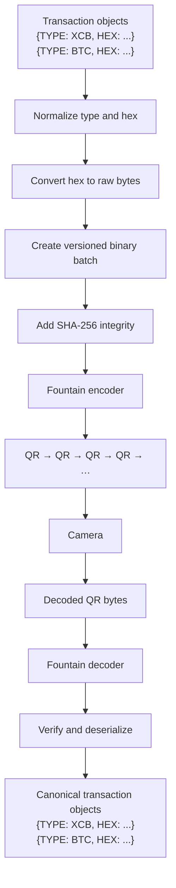

# Flutter BarcodeTX

`flutter_barcodetx` transports one or more already-signed blockchain transactions between devices with an unbounded animated QR stream and deterministic fountain-style erasure coding.

[](https://pub.dev/packages/flutter_barcodetx)
[](LICENSE)
[](https://github.com/DataLayerHost/flutter_barcodetx/actions/workflows/test.yml)

BarcodeTX treats every signed transaction as opaque bytes. It does not sign, broadcast, inspect chain semantics, validate consensus rules, calculate transaction hashes, or handle private keys. Arbitrary caller-provided chain identifiers are supported.

## Pipeline



Transaction types and public hex output are uppercase. An input `0x`/`0X` prefix is accepted and removed; reconstructed hex never includes a prefix. Hex is converted to raw bytes before serialization, so `AB12CD34` occupies four transaction bytes rather than eight ASCII bytes.

## Installation

```sh
flutter pub add flutter_barcodetx
```

## Encode and display

```dart
import 'package:flutter_barcodetx/flutter_barcodetx.dart';

final transactions = [
  BarcodeTxTransaction(type: 'xcb', hex: '0xABCD'),
  BarcodeTxTransaction(type: 'btc', hex: '02000000'),
];

final encoder = BarcodeTxEncoder(transactions: transactions);
print(encoder.transferId); // 12 uppercase hexadecimal characters

encoder.frames.listen((frame) {
  sendToQrRenderer(frame.bytes); // compact binary, not Base64
});
```

Map input is also accepted:

```dart
final encoder = BarcodeTxEncoder(transactions: [
  {'type': 'xcb', 'hex': '0xabcd'},
  {'type': 'btc', 'hex': '02000000'},
]);
```

Use the included widget to render the continuous stream:

```dart
BarcodeTxAnimatedQr(
  transactions: transactions,
  size: 320,
  frameDuration: const Duration(milliseconds: 150),
)
```

Tune QR density and defensive limits with `BarcodeTxOptions`. The default frame is at most 800 bytes and uses QR error correction level M.

## Decode camera output

The core decoder has no camera dependency. Feed it the raw byte payload returned by a scanner:

```dart
final decoder = BarcodeTxDecoder();

for (final bytes in scannerRawByteStream) {
  final state = decoder.addFrame(bytes);
  print('${(state.progress * 100).round()}%');

  if (state.isComplete) {
    for (final transaction in decoder.transactions) {
      print('${transaction.type}: ${transaction.hex}');
    }
  }
}
```

Once the first valid frame selects a transfer, frames from another transfer are ignored and return `accepted: false`. Duplicates and arbitrary ordering are supported. See the runnable [`mobile_scanner` example](example/) for a progress UI and raw-byte camera integration.

## Recovery and integrity

- QR Reed-Solomon error correction helps recover a visually damaged QR symbol.
- Fountain equations recover source blocks when entire displayed frames are missed.
- A compact CRC-32 rejects a damaged individual frame before it enters the solver.
- SHA-256 verifies the entire reconstructed canonical batch end to end.
- The first six SHA-256 bytes form a transfer ID for session grouping and accidental-collision avoidance; it is not authentication.

The codec begins with systematic degree-one symbols, then emits an effectively unbounded deterministic stream of degree 2–8 XOR equations. The decoder performs binary Gaussian elimination and completes only at full rank. This is real erasure coding, not `N/N` chunk sequencing. For adversarial tampering, use an authenticated transport or verify transaction details through a trusted application workflow.

## Documentation

- [Binary interoperability protocol](PROTOCOL.md)
- [Security model and limits](SECURITY.md)
- [Camera example](example/)
- [Runtime benchmark](tool/benchmark.dart)

## License

Licensed under the [CORE License](LICENSE). Source distributions, modifications, and contributions must remain publicly available.
